# Dockerized Node.js Application Deployment on AWS ECS Fargate using Terraform

## 1. Project Overview
This project deploys a small Express application to AWS ECS Fargate behind an Application Load Balancer. I built the infrastructure with Terraform and wired deployment through GitHub Actions so a push to `main` builds the container image, pushes it to ECR, and updates the ECS service.

The app itself is intentionally simple. It exposes `GET /` and returns:

```json
{ "status": "running" }
```

There is also a `GET /health` endpoint that the ALB uses for health checks.

## 2. Solution Architecture
The design keeps the public entry point at the ALB and runs the ECS tasks in private subnets. That gives the service a clean network boundary and keeps the container tasks out of direct internet exposure.

Why I set it up this way:
- The ALB handles inbound traffic on port 80.
- ECS tasks run with no public IPs.
- The tasks still reach ECR, CloudWatch, and the internet through a NAT gateway.
- Terraform owns the full stack, so the environment can be recreated from scratch.

### Mermaid Architecture Diagram
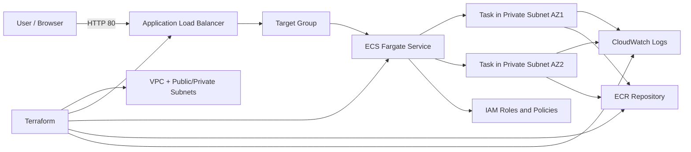

## 3. Architecture Diagram
The repository also includes a draw.io version of the architecture in [docs/architecture-diagram.drawio](docs/architecture-diagram.drawio) and a short written overview in [docs/architecture.md](docs/architecture.md).

## 4. Repository Structure
```text
DockerProject/
├── app/
│   ├── app.js
│   ├── package.json
│   ├── package-lock.json
│   └── Dockerfile
├── terraform/
│   ├── provider.tf
│   ├── networking.tf
│   ├── security.tf
│   ├── iam.tf
│   ├── ecr.tf
│   ├── ecs.tf
│   ├── alb.tf
│   ├── cloudwatch.tf
│   ├── outputs.tf
│   └── terraform.tfvars.example
├── docs/
│   ├── architecture-diagram.drawio
│   └── architecture.md
└── .github/workflows/
    └── deploy.yml
```

## 5. Infrastructure Components
The Terraform configuration creates the following:

- VPC with DNS support enabled
- Two public subnets for the ALB and NAT gateway
- Two private subnets for ECS tasks
- Internet Gateway
- Public and private route tables
- NAT gateway for outbound access from private subnets
- Security groups for the ALB and ECS tasks
- ECR repository for application images
- ECS cluster
- ECS task definition
- ECS service on Fargate
- Application Load Balancer and target group
- CloudWatch log group
- CloudWatch CPU and memory alarms
- IAM execution and task roles

## 6. Prerequisites
Before deploying, make sure the following are available locally:

- AWS account with permissions for VPC, ECS, ECR, IAM, ALB, CloudWatch, and related networking resources
- AWS CLI configured with credentials that can create and update those resources
- Terraform `>= 1.5.0`
- Node.js `20` or later
- Docker Desktop or another Docker engine

### Example AWS CLI setup
```bash
aws configure
```

## 7. Local Application Setup
Run the app locally from the `app` directory.

```bash
cd app
npm install
npm start
```

Test the endpoints in another terminal:

```bash
curl http://localhost:3000/
curl http://localhost:3000/health
```

Expected responses:

```json
{ "status": "running" }
```

```json
{ "health": "ok" }
```

## 8. Docker Build and Test
The Dockerfile installs production dependencies, runs the container as the `node` user, and exposes port `3000`.

Build the image from the repository root:

```bash
docker build -f app/Dockerfile -t dockerproject-app:local app
```

Run the container:

```bash
docker run --rm -p 3000:3000 dockerproject-app:local
```

Verify the container:

```bash
curl http://localhost:3000/
curl http://localhost:3000/health
```

## 9. Terraform Deployment Steps
The infrastructure is defined under `terraform/`. I used a separate Terraform directory so the app code and infrastructure code stay split cleanly.

```bash
cd terraform
terraform init
terraform validate
terraform plan -out=tfplan
terraform apply tfplan
```

If you want to supply your own values, copy the example file first:

```bash
copy terraform.tfvars.example terraform.tfvars
```

Useful outputs after apply:

- `alb_dns_name`
- `ecr_repository_url`
- `ecs_cluster_name`
- `ecs_service_name`
- `ecs_task_family`
- `ecs_container_name`

## 10. Container Deployment Process
The deployment flow is straightforward:

1. Build the app image.
2. Push the image to ECR.
3. Register a new ECS task definition revision with the new image tag.
4. Update the ECS service to point to the new revision.
5. Wait for the service to become stable.

### Mermaid Deployment Workflow
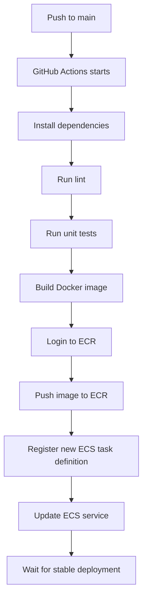

## 11. ECS Service Configuration
The ECS service is configured for Fargate with two running tasks by default.

Key settings from Terraform:

- `launch_type = "FARGATE"`
- `desired_count = 2`
- `network_mode = "awsvpc"`
- Tasks placed in private subnets
- `assign_public_ip = false`
- Deployment circuit breaker enabled with rollback
- Minimum healthy percent set to `50`
- Maximum percent set to `200`

I kept the task count at two because it gives the service a basic level of availability across two AZs without making the assignment more complicated than it needs to be.

## 12. Load Balancer Configuration
The ALB is internet-facing and listens on port `80`.

Configuration details:

- ALB lives in the public subnets
- Security group allows inbound HTTP from `0.0.0.0/0`
- Target group uses `ip` targets for Fargate tasks
- Listener forwards traffic to the target group
- Health check path is `/health`

I used `/health` rather than `/` so the load balancer checks a lightweight endpoint that clearly shows the app is alive.

## 13. Logging and Monitoring
Container logs are sent to CloudWatch Logs with the `awslogs` driver.

Details:

- Log group: `/ecs/dockerproject`
- Stream prefix: `ecs`
- Retention: 14 days by default

CloudWatch alarms are defined for:

- ECS CPU utilization above 80%
- ECS memory utilization above 80%

If SNS topics are needed later, they can be attached through `alarm_actions` and `ok_actions`.

### Useful log command
```bash
aws logs tail /ecs/dockerproject --since 1h --follow
```

## 14. Security Configuration
The security setup is basic but sensible for this kind of assignment:

- Only the ALB is public.
- ECS tasks do not get public IPs.
- The ECS security group only accepts traffic from the ALB security group on the app port.
- IAM is split between the execution role and the task role.
- The container runs as a non-root user in the image.
- `x-powered-by` is disabled in Express.

That keeps the app easy to operate without opening more network access than needed.

## 15. Validation Steps
I validated the stack in the following order:

```bash
cd app
npm test
npm run lint
```

```bash
docker build -f app/Dockerfile -t dockerproject-app:local app
docker run --rm -p 3000:3000 dockerproject-app:local
```

```bash
cd terraform
terraform validate
terraform plan -out=tfplan
terraform apply tfplan
```

### Validation Checklist
- [ ] `GET /` returns `{ "status": "running" }`
- [ ] `GET /health` returns `{ "health": "ok" }`
- [ ] Docker image builds without errors
- [ ] Container starts and listens on port `3000`
- [ ] Terraform plan completes successfully
- [ ] Terraform apply creates the VPC, ALB, ECS service, ECR repo, and CloudWatch resources
- [ ] ECS tasks reach a healthy state
- [ ] ALB target group shows healthy targets
- [ ] Application is reachable through the ALB DNS name
- [ ] CloudWatch logs show container startup and request logs

## 16. Deployment Verification
After deployment, I verified the service with the ALB DNS name from Terraform output.

```bash
curl http://<alb-dns-name>/
curl http://<alb-dns-name>/health
```

What I checked:

- The root path returns HTTP 200 with the running status JSON.
- The health endpoint returns HTTP 200.
- The ECS service shows running tasks.
- The target group marks the tasks healthy.
- CloudWatch contains the container logs.

## 17. Troubleshooting Notes
| Issue | What Usually Causes It | Fix |
|---|---|---|
| ALB returns `503 Service Unavailable` | ECS tasks are not healthy or the target group is pointing at the wrong path | Check the target group health check path and confirm the service has running tasks |
| ECS task stops during startup | The container image is broken or the task cannot pull the image from ECR | Review the ECS service events and CloudWatch logs, then verify the image tag in the task definition |
| `terraform apply` fails on IAM | The AWS credentials do not have enough permissions | Re-run with a role or user that can create IAM roles, ECS resources, ECR repositories, and VPC components |
| GitHub Actions cannot push to ECR | Missing or incorrect GitHub secrets, or ECR repository name mismatch | Check the repository secrets and confirm `ECR_REPOSITORY` matches the Terraform output |
| Tasks stay in `PENDING` | Networking or NAT gateway issue in the private subnets | Verify route tables, NAT gateway creation, and security group rules |
| Logs are missing in CloudWatch | Task execution role is missing log permissions or the log group was not created | Check the execution role attachment and confirm the log group exists |
| Browser cannot reach the app | Wrong ALB DNS name or listener not created | Recheck Terraform outputs and confirm the ALB listener is on port 80 |

## 18. Screenshots
The screenshots below reflect the current deployment and validation steps captured from AWS and local verification.

### Terraform apply output
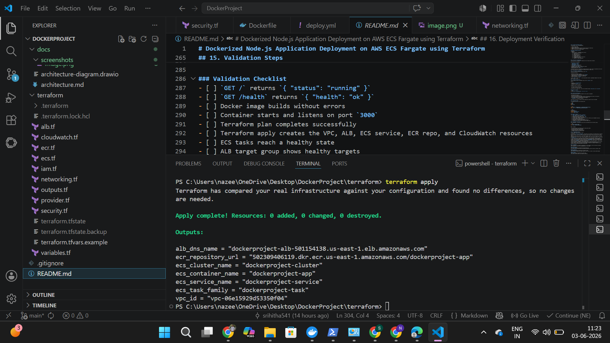
This capture shows the `terraform apply` run finishing successfully and printing the key outputs like the ALB DNS name, ECR repository URL, and ECS identifiers. It is the final confirmation that the infrastructure state in AWS matches the Terraform plan.

### ECR repository images
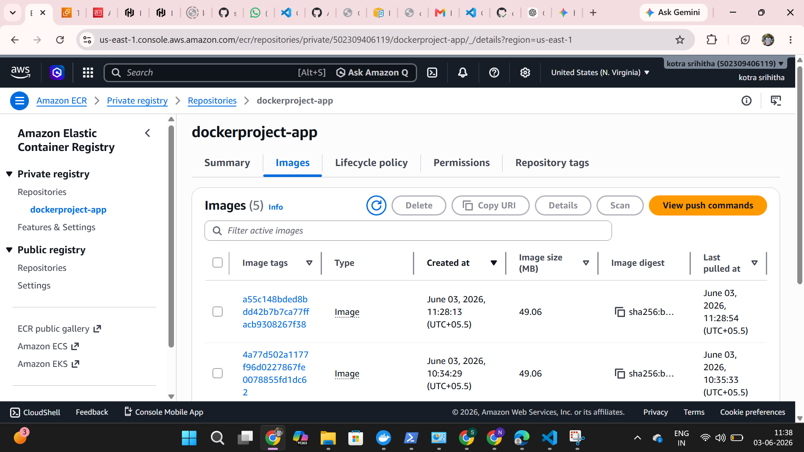
The ECR repository page lists the built images for `dockerproject-app`, which confirms the CI/CD pipeline pushed container images to the registry and that they are available for ECS to pull.

### ECS cluster overview
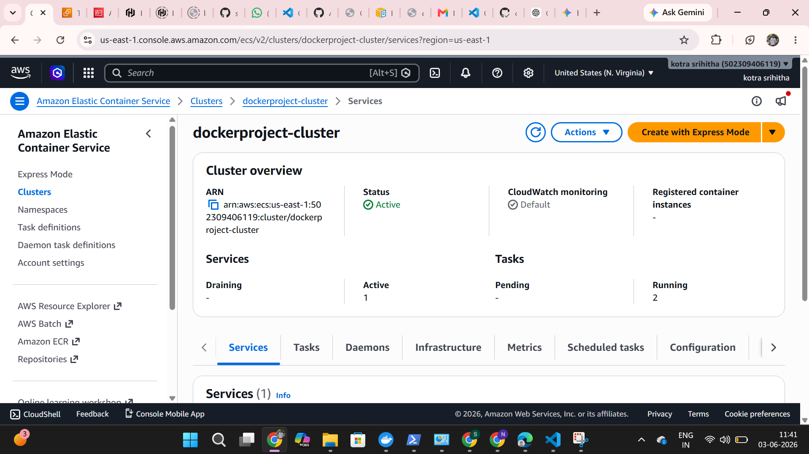
The ECS cluster is marked active and shows the service count and running tasks, which verifies the cluster was created and is currently hosting the service.

### ECS service health
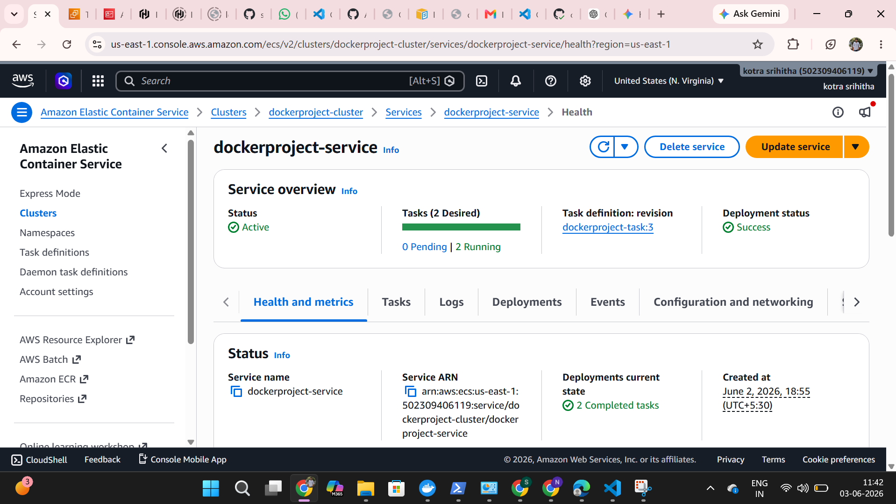
This view shows the service status as active, a desired count of two tasks, and a successful deployment status. It also confirms the service is running the expected task definition revision.

### Rolling deployment status
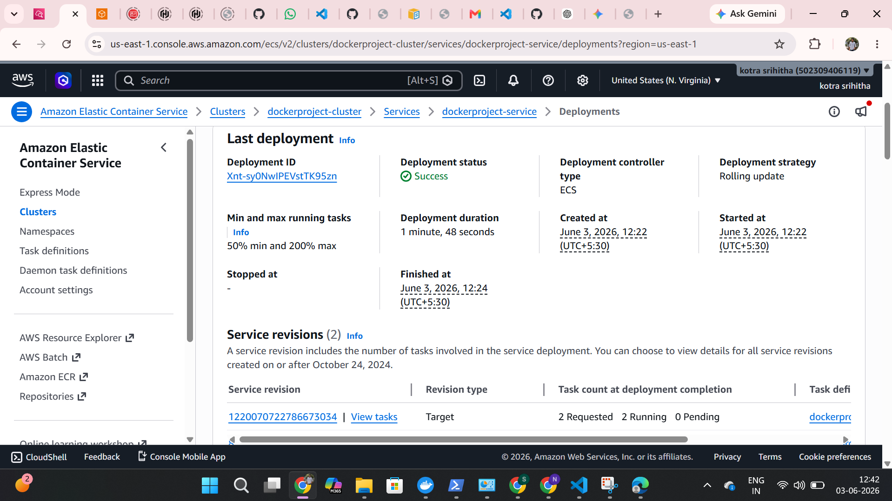
This page shows the most recent ECS deployment with a successful status and the deployment strategy set to rolling update, which satisfies the rolling deployment requirement.

### ECS tasks running
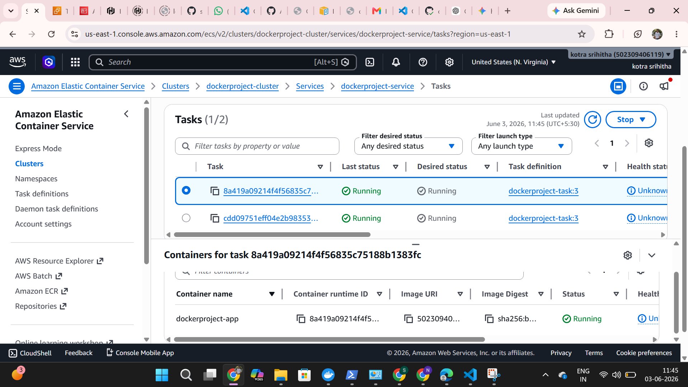
The tasks page lists the running tasks and their container details, confirming the application containers are started and healthy under the service.

### Target group health
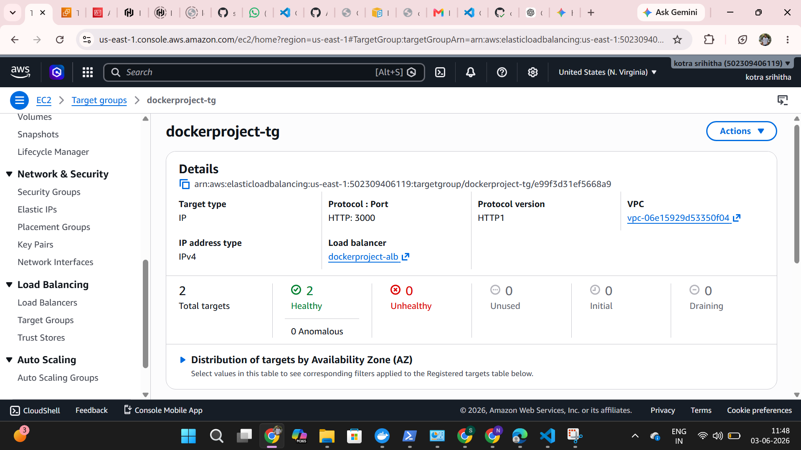
The target group details show IP targets on port 3000 with healthy counts, which confirms the ALB health checks are passing against the ECS tasks.

### ALB details
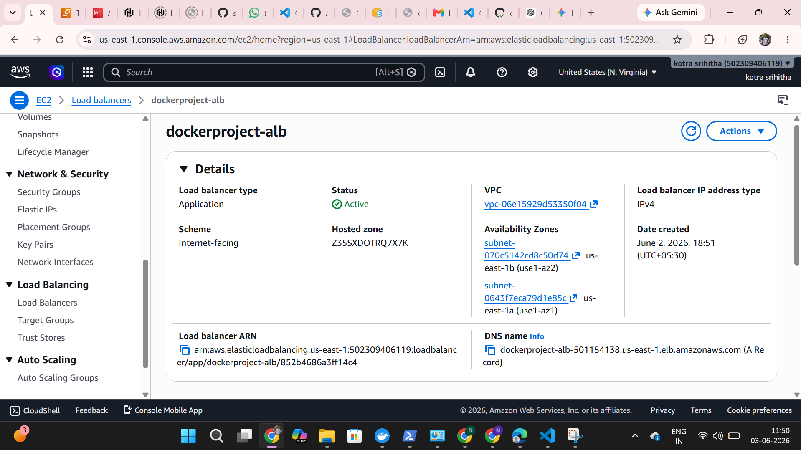
The load balancer details confirm it is internet-facing, active, and provides the DNS name used to access the application.

### Application running
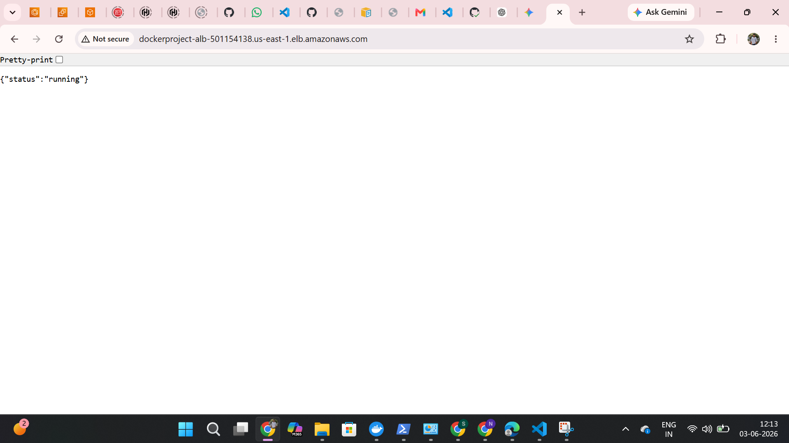
This browser capture shows the ALB DNS in the address bar and the JSON response from the root path, which proves the service is reachable from the public endpoint.

### CloudWatch alarms
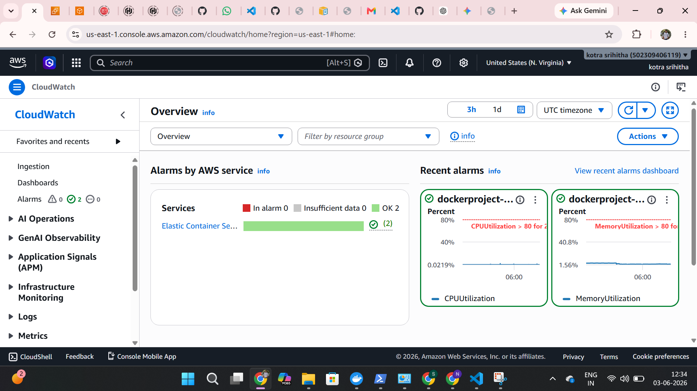
The CloudWatch overview shows the CPU and memory alarms in OK state, confirming the monitoring and alerting setup for the ECS service.

### Local validation and tests
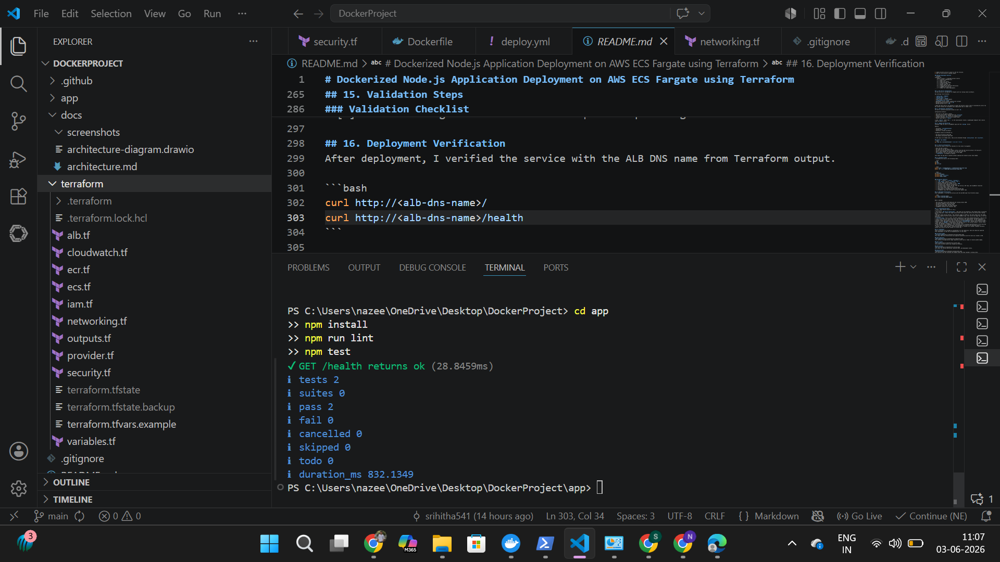
This screenshot captures local validation steps in the terminal, including dependency installation, linting, and tests. It documents that the app is clean before deployment and that the health endpoint responds as expected.

### GitHub Actions deployment
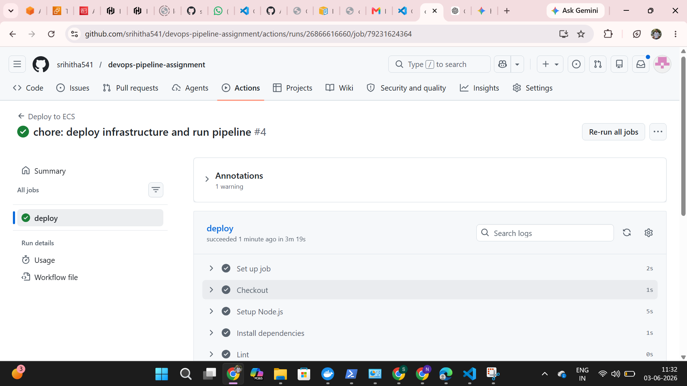
The Actions run shows a successful pipeline execution, proving the automated build, push, and deploy steps completed without errors.

## 19. Lessons Learned
This project reinforced a few practical points:

- Keeping the app and infrastructure in separate folders makes the repo easier to review.
- A small health endpoint is worth adding early because it simplifies load balancer checks.
- Running ECS tasks in private subnets is the safer default, even for a simple assignment.
- GitHub Actions works well for this flow as long as the AWS secrets and ECS names stay aligned with Terraform outputs.
- CloudWatch logs are the first place to check when a task fails before it becomes healthy.

## 20. Possible Improvements
If I were taking this beyond the assignment, I would probably do the following:

- Switch GitHub Actions to OIDC instead of static AWS keys.
- Add HTTPS on the ALB with ACM.
- Add ECS service autoscaling based on CPU or request load.
- Replace the NAT gateway with VPC endpoints where it makes sense.
- Add a deployment stage for staged approval before pushing to `main`.
- Add more API routes and real application tests.

## Cleanup Instructions
To remove everything created by Terraform:

```bash
cd terraform
terraform destroy
```

If you pushed images to ECR during testing, you may also want to delete the repository after destroying the stack.

## GitHub Actions Notes
The workflow in [.github/workflows/deploy.yml](.github/workflows/deploy.yml) runs on pushes to `main` and on manual dispatch. It installs the app dependencies, runs lint and tests, builds the Docker image, pushes it to ECR, registers a new task definition, and updates the ECS service.

### Required GitHub Secrets
- `AWS_ACCESS_KEY_ID`
- `AWS_SECRET_ACCESS_KEY`
- `AWS_REGION`
- `ECR_REPOSITORY`
- `ECS_CLUSTER`
- `ECS_SERVICE`
- `ECS_TASK_FAMILY`
- `ECS_CONTAINER_NAME`

## Terraform Outputs
The most useful outputs are defined in [terraform/outputs.tf](terraform/outputs.tf).

```bash
terraform output alb_dns_name
terraform output ecr_repository_url
terraform output ecs_cluster_name
terraform output ecs_service_name
```

## Notes
I kept the implementation deliberately small so the infrastructure is easy to explain in an interview or assignment review. The main goal here was to show the full path from source code to a running ECS service with a clean deployment flow and enough monitoring to diagnose failures.
